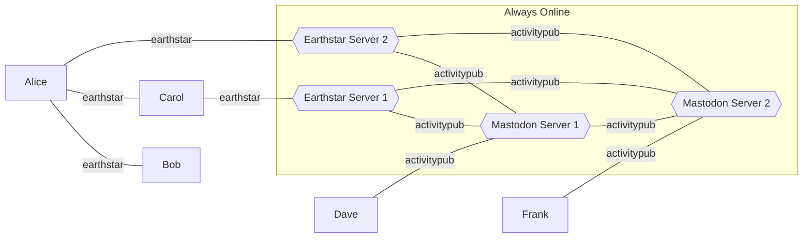

# activitystar
An adaption of ActivityStreams / ActivityPub to p2p, using Earthstar

## Status

General musings at present...

## Why?

Why use activities / activitypub as a base?
- It offers the potential for some neat bridging, where you can run a relay that speaks both activitypub and earthstar, and anyone who opts in can have their feeds published on activitypub, or conversely can follow people in the fediverse.
- It means less reinventing the wheel - don't need to think about what a Note means, use the existing definitions.

## Naming?

ACTIVITYpub + earthSTAR

Naming is hard. Tell me if you have a better idea :D

## How does this compare to Mastodon timelines?

### Home timeline

Much the same - posts from anyone you directly follow

### Local / Community

This is where it differs - I anticipate the existence of ssb-style `pub` servers / earthstar relays.

Clients would follow a pub, and the pub follows back (pub owner does the moderation here, like a Mastodon server)

So these posts would all show up in Federated too - but you could have tabs in the client for each of the pubs you follow.

### Federated

All the public posts that you've synced.

## Capabilities

So, we have a data format, but how do people see it?

Grant capabilities to them!

- The client app will need to grant capabilities to other identities using the [capability](https://github.com/earthstar-project/application-formats/pull/6) spec.
- So the first cap is the cap for seeing capabilities, then further caps after that
- If you're using one/many relays you'll also want them to have capabilities for everything to sync it, though not necessarily keys
  - You want the relay to sync your follower-only messages and DMs, but not decrypt them
  - Depending on your level of trust, you might let anyone download everything by granting a public cap, e.g. like SSB. Would mean people can see when you post, but not to who
- It's likely you'll want to grant public access to `/capabilities`, so that can be synced everywhere, and let people pick up the relevant caps for other things
- Also you'll probably want this for your `/actor`, and `/public/...` paths - like in Mastodon, public is public, anyone can see without auth etc.
- Of course how do people get the initial capabilitiy even if it's signed to public?
  - Publish it in your `/actor`?
  - Ponder, should your list of followers/following also include their public caps to aid discovery? Not sure how else you'd be able to do the follower of follower thing like SSB

### Security Levels

Some ideas on what security levels might look like for an individual user

#### High security

- Grant public access to `/capabilities`. This is the cap in your bio, the one you hand out as a link, etc
- Your `/followers` contains a list of the public capability of each of the people you follow
- Your `/following` contains a list of the public capabilitie of each of the people who follow you
- Grant public access to /public
- Grant your followers access to /followers
- Grant individual DM recipients access to individual DM paths
- Allows people to infer the total count of followers & DM recipients you have (because of the issued capabilities)
- Requires you & a follower or DM recipient to be online and have the other as a peer to exchange any data

#### Medium security

In addition to the above:
- Grant the relays you're on access to /followers
- (?) Grant your followers access to /direct
- Grant the relays you're on access to /direct
- Allows the relays to see how many & when followers and DM posts happen
- Allows your followers to see how many/when DMs etc

This feels like it maps to the state of SSB?

#### Low security

In addition to the above:
- Grant public access to your entire subspace.
- Allows everyone to read your public posts
- Allows everyone to know how many & when your followers posts are
- Allows everyone to know how many, to how many people & when your DMs are
- Doesn't allow people to read the contents of followers / DMs
- Best usability and reach of your stuff. Potentially allows DM communication across many unknown hops

## Federation

Principles:
- This should be interoperable with the wider fediverse
- Consent should be respected in line with the current fediverse semantics

Theory:
- We'll call a server that's running both earthstar and activitypub protocols a bridge node
- From the earthstar side:
  - You have to send a `StartFederation` activity to the bridge node's identity
  - You _SHOULD_ only be federated with one server at a time (to avoid message duplication in the fediverse)
  - From this timestamp on, any activities it sees will be processed the same way they would normally - forwarded on to other servers in the `to` etc
  - It'll rewrite any identities into a form suitable for http semantics, e.g. mentions etc
    - If it's seen a `StartFederation` for some other identity, it'll use that server's address
    - If it's not they'll be left as an earthstar address?
  - TODO: `StopFederation`, stops forwarding, leaves identity active
    - A future `StartFederation` to another server should have the original one post a final `moved` message - or should the client need to do this BEFORE StopFederation? unsure
    - `DeleteFederation` to trash all hosted content?
- This is not a _full_ bridge - it will act the way any other fediverse server works
  - If it sees a `Follow` it'll send the follow request to the destination
  - If they Reject, forwards that back into earthstar
  - If they accept, it'll start publishing their activities into it's local subspace.
    - To keep the convention with the way the fediverse works, these activities _MUST_ only be accessible by identities federated with this bridge, e.g. caps and keys
      - i.e. bridges should use the High security level. This seems fairly reasonable from a usability standpoint - the bridge is always online.
  - The owner of the bridge is responsible for moderation in the same way a fediverse server owner is, e.g. you'll get defederated if you let spam through etc.

Summing up:
- No-one else on the fediverse should see this as any different to a Mastodon instance, for example
- They'll only see a given earthstar identity coming from one place
- Messages they send will only be sent to the people in their followers, or other people on the same instance(bridge), in line with toot visibility

Caveats:
- Not all earthstar stuff will make it to the fediverse - opt-in by design
- Obviously a bad actor can copy and forward stuff around - but they can do that with activitypub too
- Private messages between earthstar and fediverse participants will be vulnerable to snooping by the bridge owner - same as with a fediverse server

### Diagram / Examples

- Alice has asked `EarthStar Server 2` to be her bridge Node
- Carol has asked `EarthStar Server 1` to be her bridge Node
- Dave is registered on `Mastodon Server 1`

If I'm Bob, and I publish activities in my public share:
- If Alice follows me, when we're both online or meet up, we can sync using Willow and she'll see my activities
- If Carol follows Alice, then she'll be able to see them too after a sync
- If I grant capabilities / publish a  `StartFederation` message to `Earthstar Server 1` - when they sync across, they'll be visible on that server for people to see and interact with.
- If people have followed me in the fediverse, those posts would also be sent on sync to `Mastodon Server 1`, `Mastodon Server 2` as appropriate - wherever someone follows me.

If I'm Bob, and I write some DMs in my direct messages outbox
- They get synced to whoever I've given capabilities to, e.g. both Alice and Carol.
- If they're encrypted to Carol's key, Alice can't read them, but knows how many & when they were sent. Carol can read them when they're synced, and reply.
- If I've sent them to the key set up by `Earthstar Server 1` on behalf of Dave (Because I've chosen that bridge to federate, and I follow Dave), they get synced with willow until they reach there, then the bridge software sends the activity unencrypted to `Mastodon Server 1`. (Note this is in line with current Fediverse security, not end to end encrypted, but would be over an HTTPS transport etc.).

## FAQ

**Q: Doesn't activitypub mean you have to be always online?**

**A:** No, but also yes. For the fediverse interopability, the bridge nodes need to be online. These are the pubs of the SSB world. But the clients, and any p2p operation doesn't need to be. If you don't want to federate to/from the fediverse, you don't need to be online at all.

**Q: Does activitystreams / activitypub constrain this in other ways?**

**A: ** Somewhat. Take the types of activities - if you want other people to understand them, then yes, you need to stick with the kinds their software understands. If we made up the protocol from scratch, none of this would be shared. By reusing the definitions of Follow, Notes etc, we can get a lot of the basics for free, in ways other people may already understand. This doesn't stop us making our own types of activites up though - other people will ignore them, but that's fine. And this doesn't need to be standardised up front - anyone can make up a new kind and start using it.

**Q: With the fediverse stuff, is there any duplication?**

**A: ** Some. The bridge node you've chose should be unique for you - no-one in the fediverse will see your Notes twice. Dave's Notes in the fediverse would get published under different subspaces by both Earthstar servers - however each individual participant in earthstar would only see them once, as you'd only be following a single bridge.
