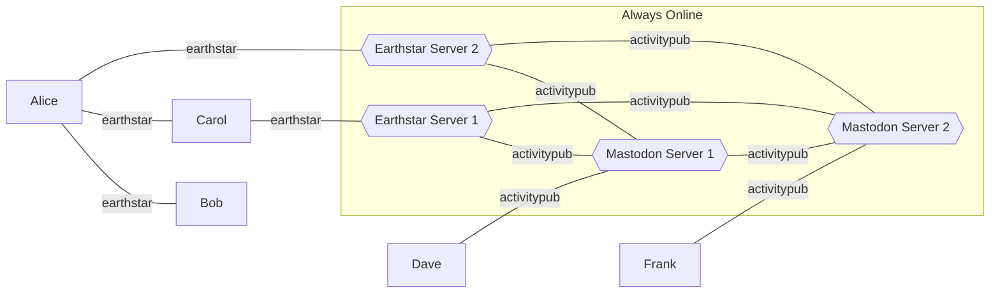

# Federation

## Status

General musings at present...

## Federation

Principles:
- This should be interoperable with the wider fediverse
- Consent should be respected in line with the current fediverse semantics

Theory:
- We'll call a server that's running both earthstar and activitypub protocols a bridge node
- From the earthstar side:
  - You have to send a `StartFederation` activity to the bridge node's identity
  - You _SHOULD_ only be federated with one server at a time (to avoid message duplication in the fediverse)
  - From this timestamp on, any activities it sees will be processed the same way they would normally - forwarded on to other servers in the `to` etc
  - It'll rewrite any identities into a form suitable for http semantics, e.g. mentions etc
    - If it's seen a `StartFederation` for some other identity, it'll use that server's address
    - If it's not they'll be left as an earthstar address?
  - TODO: `StopFederation`, stops forwarding, leaves identity active
    - A future `StartFederation` to another server should have the original one post a final `moved` message - or should the client need to do this BEFORE StopFederation? unsure
    - `DeleteFederation` to trash all hosted content?
- This is not a _full_ bridge - it will act the way any other fediverse server works
  - If it sees a `Follow` it'll send the follow request to the destination
  - If they Reject, forwards that back into earthstar
  - If they accept, it'll start publishing their activities into it's local subspace.
    - To keep the convention with the way the fediverse works, these activities _MUST_ only be accessible by identities federated with this bridge, e.g. caps and keys
      - i.e. bridges should use the High security level. This seems fairly reasonable from a usability standpoint - the bridge is always online.
  - The owner of the bridge is responsible for moderation in the same way a fediverse server owner is, e.g. you'll get defederated if you let spam through etc.
- From the activitypub side:
  - When it sees activities from a new identity, it creates a new `<actor-id>` for that actor and publishes the activities there.
  - It'll grant capabilities so the appropriate people who're using it for federation can access those outboxes.

Summing up:
- No-one else on the fediverse should see this as any different to a Mastodon instance, for example
- They'll only see a given earthstar identity coming from one place
- Messages they send will only be sent to the people in their followers, or other people on the same instance(bridge), in line with toot visibility

Caveats:
- Not all earthstar stuff will make it to the fediverse - opt-in by design
- Obviously a bad actor can copy and forward stuff around - but they can do that with activitypub too
- Private messages between earthstar and fediverse participants will be vulnerable to snooping by the bridge owner - same as with a fediverse server

### Diagram / Examples

- Alice has asked `EarthStar Server 2` to be her bridge Node
- Carol has asked `EarthStar Server 1` to be her bridge Node
- Dave is registered on `Mastodon Server 1`

If I'm Bob, and I publish activities in my public share:
- If Alice follows me, when we're both online or meet up, we can sync using Willow and she'll see my activities
- If Carol follows Alice, then she'll be able to see them too after a sync
- If I grant capabilities / publish a  `StartFederation` message to `Earthstar Server 1` - when they sync across, they'll be visible on that server for people to see and interact with.
- If people have followed me in the fediverse, those posts would also be sent on sync to `Mastodon Server 1`, `Mastodon Server 2` as appropriate - wherever someone follows me.

If I'm Bob, and I write some DMs in my direct messages outbox
- They get synced to whoever I've given capabilities to, e.g. both Alice and Carol.
- If they're encrypted to Carol's key, Alice can't read them, but knows how many & when they were sent. Carol can read them when they're synced, and reply.
- If I've sent them to the key set up by `Earthstar Server 1` on behalf of Dave (Because I've chosen that bridge to federate, and I follow Dave), they get synced with willow until they reach there, then the bridge software sends the activity unencrypted to `Mastodon Server 1`. (Note this is in line with current Fediverse security, not end to end encrypted, but would be over an HTTPS transport etc.).

**Q: Doesn't activitypub mean you have to be always online?**

**A:** No, but also yes. For the fediverse interopability, the bridge nodes need to be online. These are the pubs of the SSB world. But the clients, and any p2p operation doesn't need to be. If you don't want to federate to/from the fediverse, you don't need to be online at all.

**Q: With the fediverse stuff, is there any duplication?**

**A:** Some. The bridge node you've chose should be unique for you - no-one in the fediverse will see your Notes twice. Dave's Notes in the fediverse would get published under different subspaces by both Earthstar servers - however each individual participant in earthstar would only see them once, as you'd only be following a single bridge.
